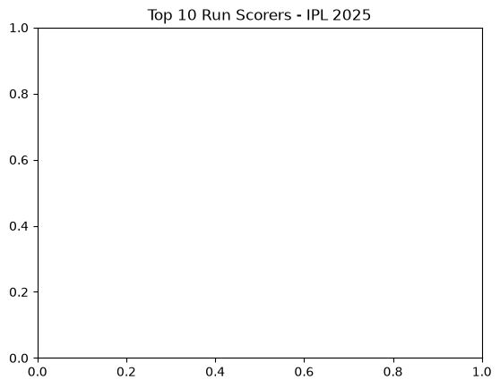
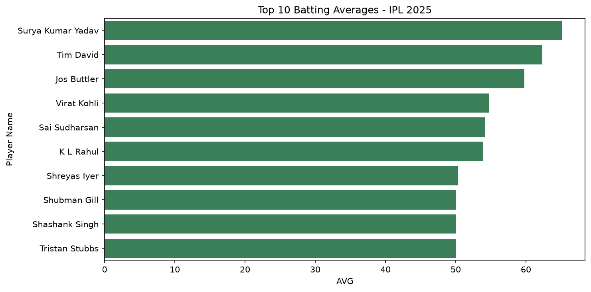
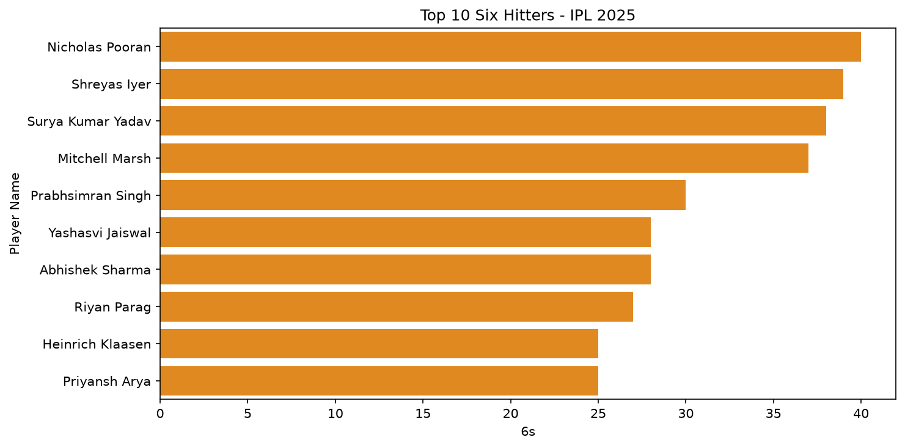
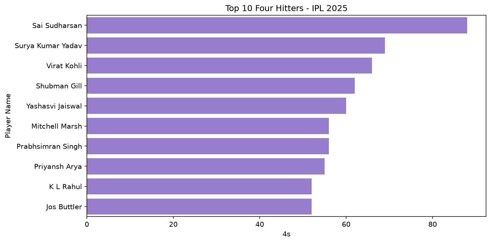
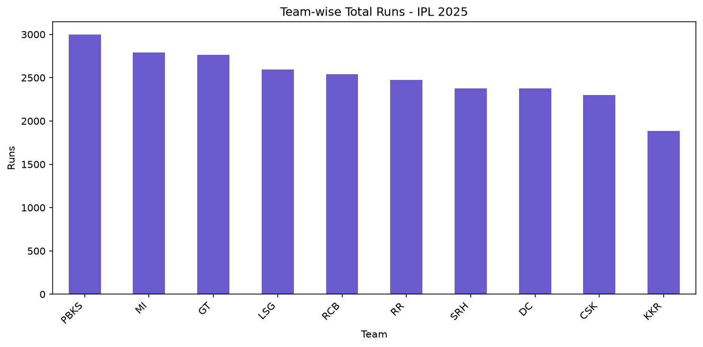
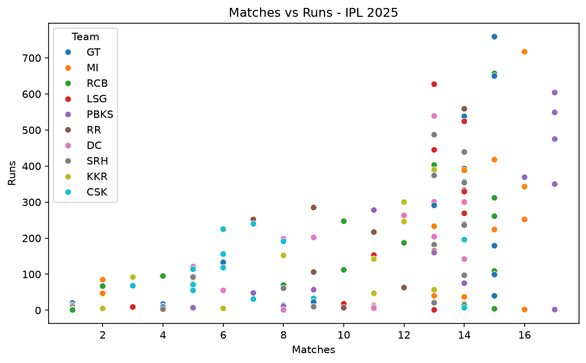

# IPL 2025 Batting Data Analysis

A small Python data analysis project exploring IPL 2025 batting statistics. It uses player-level data to compare run scoring, batting averages, boundary hitting, team run totals, and the relationship between matches played and runs scored.

## Project contents

| File | Description |
| --- | --- |
| `IPL2025Batters.csv` | Batter statistics used in the analysis |
| `IPL 2025 Data Analysis.ipynb` | Jupyter notebook with the analysis steps |
| `ipl pred.py` | Python script version of the analysis |
| `outputs/` | Saved charts and the captured results output |

The dataset includes player and team names, runs, matches, innings, not-outs, highest score, average, balls faced, strike rate, hundreds, fifties, fours, and sixes.

## Requirements

- Python 3.9 or later
- pandas
- matplotlib
- seaborn
- Jupyter Notebook (only needed to run the notebook)

Install the Python dependencies with:

```bash
python -m pip install pandas matplotlib seaborn
```

To run the notebook, also install Jupyter:

```bash
python -m pip install notebook
jupyter notebook
```

## Run the analysis

Run the notebook interactively, or execute the script from the project directory:

```bash
python "ipl pred.py"
```

The script reads `IPL2025Batters.csv` from the same directory. Its `plt.show()` calls display charts interactively. The chart files currently included in `outputs/` are the saved project results.

## Results and charts

The available output identifies Sai Sudharsan as the leading run scorer with 759 runs. PBKS has the highest team total in the dataset at 2,996 runs, followed by MI (2,792) and GT (2,763). The charts show the top 10 players by runs, batting average, fours, and sixes, alongside team totals and matches versus runs.

### Top run scorers



### Batting average



### Six hitters



### Four hitters



### Team total runs



### Matches versus runs



For the captured console output, see [`outputs/results_output.txt`](outputs/results_output.txt).
